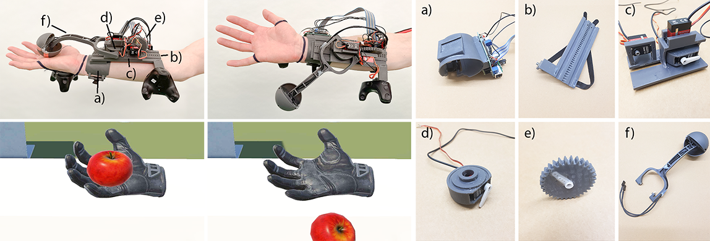

# Embracer



Figure 1: We present Embracer, a 3 DoF wearable encountered-type haptic controller. It has 3 actuated axes of motion to allow the end effector to freely target arbitrary positions on the user’s palm. Through lateral actuation, it can create stretching sensations in the user’s hand. It can also sense manipulation along the same 3 DoF and grasping of the end effector. Embracer
consists of: a) the bangle with the microcontroller and the power regulator, b) the rail with a tracker mount and Velcro straps, c) the carriage with the three servo motors, d) the housing of the pivot axis, e) the gear for the linear axis and f) the lever with the end effector.

**Embracer**: A Wearable Encountered-Type Haptic Controller for 3 DoF Input and Feedback (https://dl.acm.org/doi/10.1145/3675095.3676626)<br/>
[Dennis Dietz](http://www.dennisdietz.de), [Steeven Villa](https://www.posthci.com/), Moritz Ziarko, [Michael Bonfert](https://www.michael-bonfert.de/), [Florian Müller](https://www.flomue.com/), and [Andreas Butz](http://butz.org)<br/>
In Proceedings of the 2024 ACM International Symposium on Wearable Computers (ISWC ’24), October 5–9, 2024, Melbourne, VIC, Australia.

## License

Copyright &copy; 2024. [LMU Munich](https://lmu.de) [Media Informatics Group](https://www.medien.ifi.lmu.de/). All rights reserved.

The contained "source code" of this work is made available under the terms of [GNU GPLv3](./LICENSE) license. 

If you find our research helpful, we would appreciate citations via:

```
@inproceedings{dietzEmbracer2024,
	author 		= {Dietz, Dennis and Villa, Steeven and Ziarko, Moritz and Bonfert, Michael and M\"{u}ller, Florian and Butz, Andreas},
	title 		= {Embracer: A Wearable Encountered-Type Haptic Controller for 3 DoF Input and Feedback},
	year 		= {2024},
	isbn 		= {9798400710599},
	publisher 	= {Association for Computing Machinery},
	address 	= {New York, NY, USA},
	url 		= {https://doi.org/10.1145/3675095.3676626},
	doi 		= {10.1145/3675095.3676626},
	booktitle 	= {Proceedings of the 2024 ACM International Symposium on Wearable Computers},
	pages 		= {140–143},
	numpages 	= {4},
	keywords 	= {force feedback, haptics, input device, virtual reality},
	location 	= {Melbourne VIC, Australia},
	series 		= {ISWC '24}
}
```

